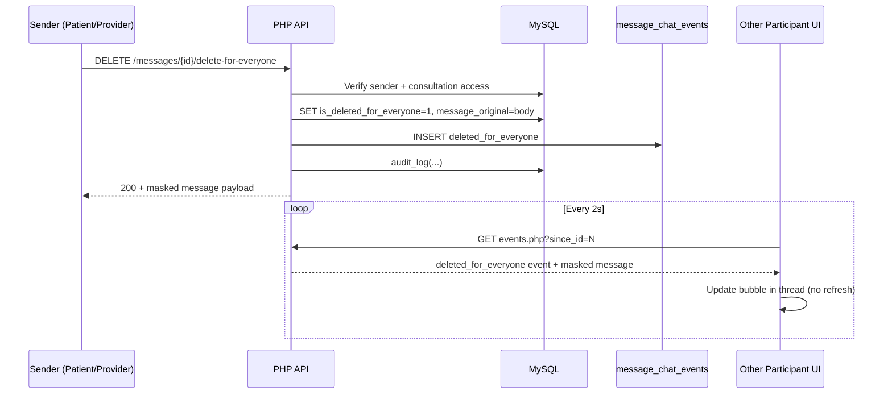

# MedConnect Messaging Deletion

Messenger-style **Delete for Me** and **Delete for Everyone** for consultation chat.

## Database schema

### `consultation_messages` (new columns)

| Column | Type | Purpose |
|--------|------|---------|
| `is_deleted_for_everyone` | `TINYINT(1)` | Global soft delete flag |
| `deleted_at` | `DATETIME` | When delete-for-everyone occurred |
| `deleted_by_user_id` | `INT UNSIGNED` | Sender who revoked the message |
| `deleted_for_me_users` | `JSON` | User IDs who hid the message locally |
| `message_original` | `TEXT` | Audit-only copy of body (never returned by API) |

### `message_chat_events`

Realtime fan-out table polled by clients (`since_id` cursor).

## API endpoints

| Method | URL | Who |
|--------|-----|-----|
| `DELETE` | `/app/api/messages/{id}/delete-for-me` | Participant |
| `DELETE` | `/app/api/messages/{id}/delete-for-everyone` | Sender only |
| `GET` | `/app/api/messages/events.php?consultation_id=&since_id=` | Participant |
| `GET` | `/app/api/messages/list.php?consultation_id=` | Participant (masks deleted content) |

Legacy POST also supported: `delete_for_me.php?message_id=` / `delete_for_everyone.php?message_id=`.

## Permissions

- **Delete for Everyone**: `sender_id === current_user_id` and not already deleted for everyone.
- **Delete for Me**: any participant; appends current user to `deleted_for_me_users` JSON.
- Enforced in `app/includes/message_deletion.php` and re-checked in API handlers.

## UI

- Hover **⋯** on a bubble, right-click, or long-press (mobile).
- Options: Delete for Me, Delete for Everyone (sender only), Cancel.
- Confirmation dialog before applying.

Deleted-for-everyone bubbles render as italic: **"This message was deleted."** with original timestamp preserved.

## Real-time updates

MedConnect uses **event polling** (2s) against `message_chat_events` — no page refresh required. This fits the existing PHP + fetch stack; Socket.IO can be added later by publishing the same events to a websocket bus.

## Sequence diagram

## Workflow

1. User opens message options on a bubble.
2. Frontend shows allowed actions based on `can_delete_for_me` / `can_delete_for_everyone` from `list.php`.
3. User confirms deletion.
4. API validates role, ownership, and consultation membership.
5. DB updated; audit entry written; chat event inserted.
6. All open clients polling `events.php` apply the change locally.

## Key files

- `app/includes/message_deletion.php` — schema, permissions, formatting
- `app/api/messages/delete_for_me.php`
- `app/api/messages/delete_for_everyone.php`
- `app/api/messages/events.php`
- `assets/js/messages-delete.js`
- `assets/css/messages-delete.css`
